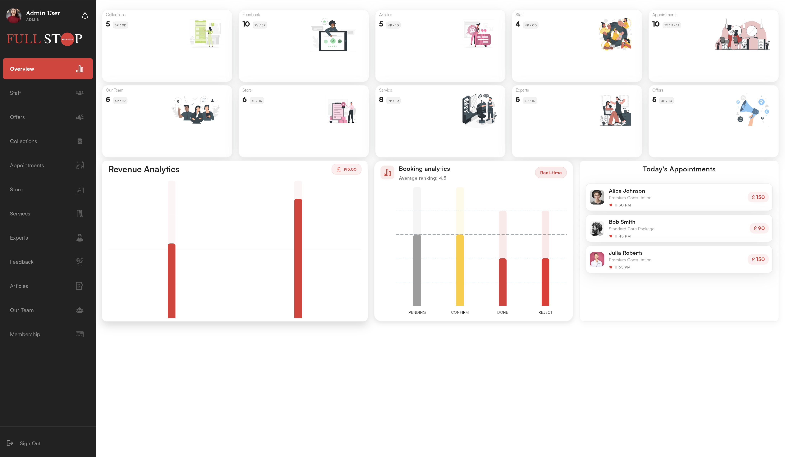
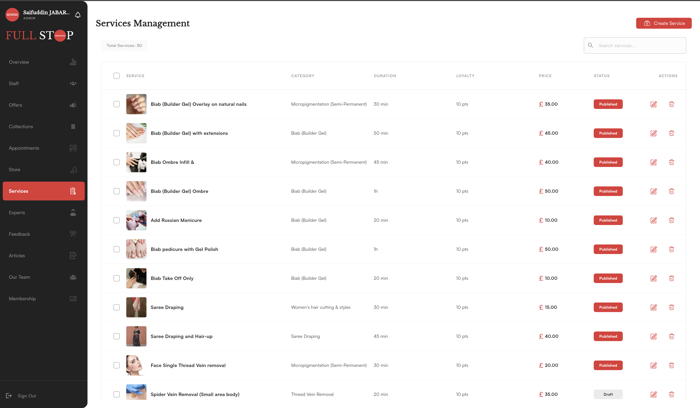
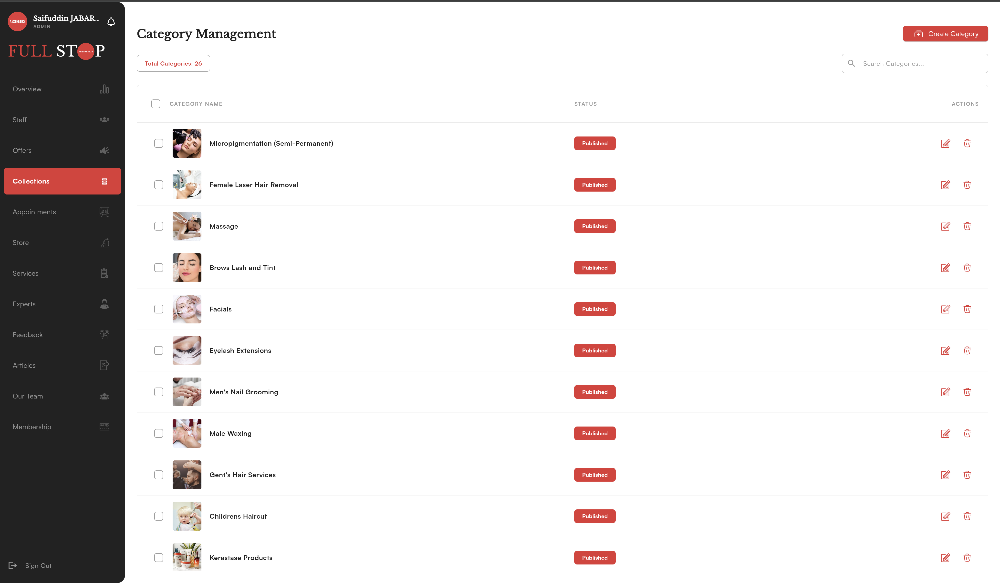
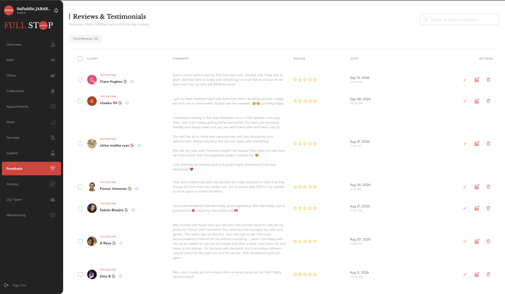

# 🩺 Aesthetic Clinic Admin Panel

A modern, responsive, and standalone Flutter-based Admin Control Dashboard designed for aesthetic clinics, wellness centers, and medical spas. Built with a clean architecture, elegant dark/light theme accents, and 100% offline-ready mock data.

---

## 📸 Screenshots & UI Preview

### 1. Main Dashboard & Analytics
Overview of key clinic metrics, revenue trends, dynamic appointment statistics, and recent activity.


---

### 2. Appointments & Bookings Management
Filter bookings by status (Confirmed, Completed, Rejected/Canceled), search client records, and manage appointment schedules.


---

### 3. Services & Treatments Catalog
Comprehensive treatment and service catalog management with pricing, category tags, duration, and status toggles.


---

### 4. Client Reviews & Feedback
Track customer ratings, review feedback, filter verified reviews, and manage promoted patient testimonials.


---

## ✨ Features

- **📊 Comprehensive Analytics**: Dynamic cards for today's bookings, revenue graphs, and service breakdowns.
- **📅 Appointment Scheduling**: Real-time filterable appointments with client profiles and status tracking.
- **👩‍⚕️ Team & Specialists**: Doctor rosters, specialty assignments, and staff profiles with authentic portrait avatars.
- **🏷️ Category & Store Management**: Manage product inventory and treatment categories with search and bulk actions.
- **⭐ Reviews & Testimonials**: Verified client rating system with promotion controls.
- **📱 Fully Responsive**: Tailored layout supporting Desktop (fixed 250px sidebar), Tablet, and Mobile (drawer menu).
- **🔒 Standalone & Offline Ready**: Pre-populated with generic mock data and dummy credentials for instant testing and presentation.

---

## 🛠️ Tech Stack

- **Framework**: [Flutter](https://flutter.dev/) (Web & Desktop support)
- **State Management**: [Provider](https://pub.dev/packages/provider)
- **Charts**: [fl_chart](https://pub.dev/packages/fl_chart)
- **Icons & Graphics**: [flutter_svg](https://pub.dev/packages/flutter_svg), Custom Vector SVGs
- **Typography**: Satoshi & Libre Baskerville

---

## 🚀 Getting Started

### Prerequisites
- [Flutter SDK](https://docs.flutter.dev/get-started/install) (3.10.0 or higher)
- Google Chrome (for Flutter Web)

### Installation & Run

1. **Clone the repository**:
   ```bash
   git clone https://github.com/meesaw77/admin-panel.git
   cd admin-panel
   ```

2. **Install dependencies**:
   ```bash
   flutter pub get
   ```

3. **Run on Chrome**:
   ```bash
   flutter run -d chrome
   ```

4. **Login Credentials**:
   - **Email**: `admin@example.com`
   - **Password**: `admin123`
   *(Click **Sign In** to immediately access the dashboard).*
